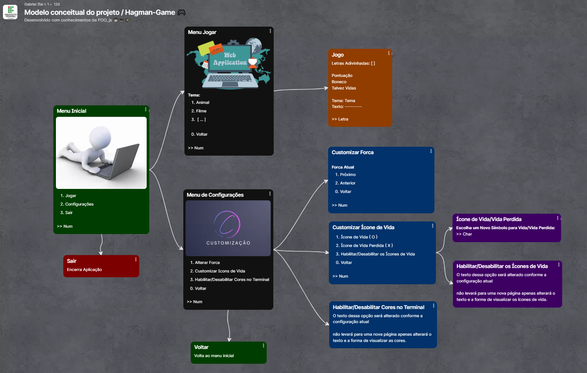

# Jogo da Forca POO 🎮🧑🏻‍💻✨

Projeto de POO realizado para o aperfeiçoamento dos conhecimentos diciplinares em forma de um jogo divertido.

## Sites

- [**Pacote do Projeto**](https://github.com/IanSantosOS/hangman-package-poo)

- [**Projeto no Terminal**](https://github.com/IanSantosOS/hangman-terminal)

- ~~Projeto no Site~~

## Colaboradores 🤝🏽

| Função | Nome | Codenome |
|--------|------|----------|
| Orientador | Ricardo Rubens | RR |
| Aluno | Ian dos Santos | Café |
| Aluno | Gabriel Rodrigues | Ghost |

## Mapa Conceitual e Exemplo Prático 🖼️

## Referência 📌

### Inpiração na criação do design da forca

https://gist.github.com/chrishorton/8510732aa9a80a03c829b09f12e20d9c

### console.clear();

https://www.w3schools.com/jsref/met_console_clear.asp

### Cor no terminal do Node.js

https://horadecodar.com.br/como-mudar-a-cor-do-console-no-terminal-em-node-js/

https://www.npmjs.com/package/colors

### ASCII Art Archive
https://www.asciiart.eu/

### Ideia Descartada 🗑️

---

**⚠ Atenção:** Este projeto originalmente incluía a utilização de uma API de dicionário, porém, essa ideia foi descartada durante o desenvolvimento.

---

**Motivo do Descarte:**
A implementação da API de dicionário não se alinhava totalmente com os objetivos do projeto, levando à decisão de abandonar essa funcionalidade específica.

**Alternativas Consideradas:**
Foram exploradas outras abordagens que melhor se adequavam aos requisitos e escopo do projeto.

